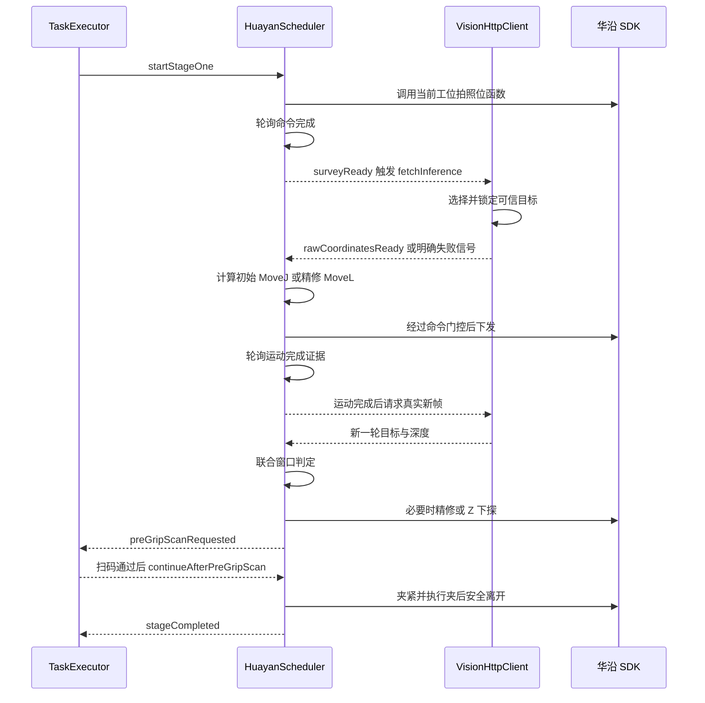
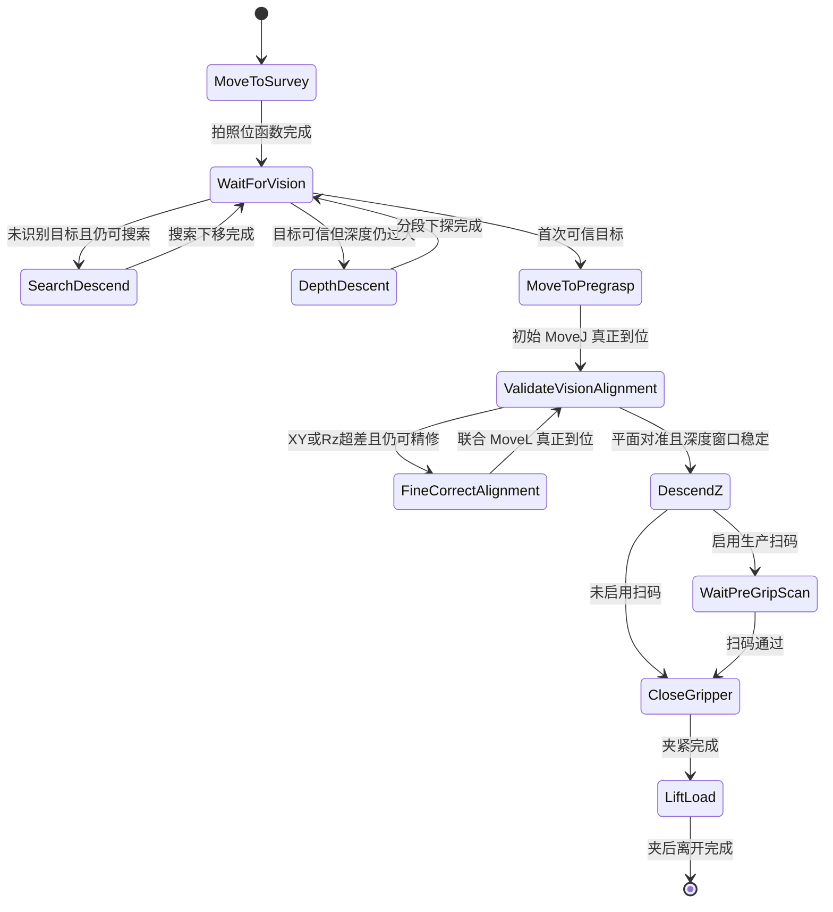

# 华沿机械臂视觉抓取与运动判断

> 本文描述当前代码的真实实现。修改机械臂 SDK 调用、视觉抓取、坐标变换、运动完成证据或阶段一安全策略时，必须同步更新本文。

## 1. 相关模块

| 模块 | 职责 |
|---|---|
| `HuayanScheduler` | 机械臂高层状态机、SDK 命令门控、动作下发、到位轮询和失败停止 |
| `VisionHttpClient` | 请求视觉服务、目标选择、目标锁定、手眼变换和结果代次隔离 |
| `VisionAlignment` | XY/Rz 对准、工具系修正、稳定深度窗口和下一动作纯判定 |
| `TaskExecutor` | 从生产任务启动阶段一，在夹紧前扫码，并消费成功、任务失败或系统错误 |
| `DeviceManager` | 建立视觉客户端与机械臂调度器之间的信号链 |
| `lineconfig.h` | 按工位提供拍照函数、夹后离开策略和 Z 下探余量 |
| `RuntimeSettings` | 提供运动速度、加速度、圆滑半径、对准容差和精修次数等运行参数 |

## 2. 信号链

`DeviceManager` 中的关键连接是：

- `HuayanScheduler::surveyReady` → `VisionHttpClient::fetchInference`
- `VisionHttpClient::rawCoordinatesReady` → `HuayanScheduler::setGrabOffset`
- `VisionHttpClient::noObjectDetected` → `HuayanScheduler::onVisionNoObject`
- `VisionHttpClient::targetRejectedByTrustRule` → `HuayanScheduler::onVisionTargetRejectedForPickup`
- `VisionHttpClient::errorOccurred` → `HuayanScheduler::onVisionErrorForPickup`

## 3. 阶段一主状态机

`advanceStep()` 是阶段步骤前进方向的唯一集中定义，`executeCurrentStep()` 负责每个步骤只下发一条动作或进入一个异步等待点。不得在 UI 主线程阻塞等待机械臂。

## 4. 视觉目标选择与锁定

阶段一每次请求视觉前，`HuayanScheduler` 通过 `makeVisionTargetSelectionContext()` 提供：

- 当前工位的可信区域；
- 已累计执行的工具系 X/Y 修正；
- 上一可信目标锚点；
- 允许丢失的帧数；
- 锚点切换距离、跟踪半径和同层 Z 容差。

`VisionHttpClient` 使用请求生成号隔离过期 HTTP 回调。阶段停止或开始新一轮推理后，旧请求即使稍后返回，也不能推进当前状态机。

目标选择原则：

- 初次选择按固定侧和同层规则确定目标。
- 锁定后优先连续跟踪同一目标，不因旁边出现新目标而静默切换。
- 目标超出可信范围或跳变过大时，发出“目标被信任规则拒绝”，而不是退化为普通无目标。
- 对准验证阶段出现无目标、目标拒绝或视觉错误时直接安全失败，不能使用旧坐标继续抓取。

## 5. 坐标修正和两类运动

### 5.1 首次联合 `MoveJ`

首次可信目标转换为工具系修正后，调度器读取当前实际 TCP 和关节位置，组合出 Base 坐标系绝对目标。

随后通过 `HRIF_WayPoint` 下发：

- 运动类型为 `MoveJ`；
- 目标是 Base/UCS 下的绝对笛卡尔位姿；
- 当前关节只作为笛卡尔逆解参考，不是关节目标；
- TCP、UCS 必须与手眼标定保持一致；
- 速度、加速度和圆滑半径来自当前运行参数快照。

首次运动的目的是从拍照位一次到达目标正上方，避免旧的 X、Y、Rz 分轴运动造成轨迹卡顿和中间姿态风险。

### 5.2 联合精修 `MoveL`

运动后仍有 XY 或 Rz 残差且精修次数未耗尽时，通过 `HRIF_WayPointRel` 下发一条工具坐标系联合 `MoveL`：

- `nType=1`，六个目标分量使用同一条线性轨迹；
- `nPointList=0`，控制器点位表参数全部为零；
- `nrelMoveType=2`，使用工具坐标系相对运动；
- 只启用 X、Y、Rz 三个轴掩码；
- X、Y、Rz 不能拆成三条 `HRIF_MoveRelL`。

视觉到工具系的方向关系由 `VisionAlignment::toToolCorrection()` 集中定义：X 同向，Y 和 Rz 反向。

### 5.3 单次调整硬边界

- 阶段一单次 X/Y 修正超过代码硬上限时拒绝下发。
- Z 下探采用“视觉深度减工位余量”，先检查未截断计划值，再受运行上限和硬上限共同限制。
- 大角度 Rz 需要两个 `frame_id` 与 `timestamp` 同时递增、方向一致且幅值接近的真实新帧确认。
- 同一阶段一锁定目标周期最多实际执行一次大角度 Rz 运动。

## 6. SDK 命令下发门控

SDK 接口返回零只代表“命令已被接口接受”，不代表机械臂已经完成运动。

所有运动和示教函数命令先进入 `PendingCommand`，再由 `beginCommandWhenReady()` 和 `pollCommandReady()` 统一门控：

1. 已有待命令或活动命令时，拒绝覆盖。
2. 查询机械臂运动状态、暂停状态和控制器状态文本。
3. 正在运动、暂停、`ProgramStopped` 或 `RobotInMoving` 时继续等待。
4. 状态查询失败时按错误处理。
5. 只有状态为自动、待机、就绪或空闲语义时才真正下发。
6. 等待命令就绪超过 8 秒时失败关闭，不强行下发。

该门控用于避免阶段切换边缘、UI 手动动作或 SDK 状态延迟导致两条命令并发。

## 7. 运动完成如何判断

### 7.1 普通示教函数和运动

命令下发后通过定时器轮询，等待机器人不再运动并结合控制器状态判断。每个命令都有明确超时，超时进入错误出口。

### 7.2 视觉 `MoveJ` 和 `MoveL`

视觉运动不能只根据“当前 moving=false”或一次残留的 `blendingDone=true` 判断完成。当前实现使用两类证据：

正式完成证据：

- 当前已不在运动；
- blending 查询成功且为完成；
- 本轮曾观察到机械臂运动，或者曾观察到 blending 从未完成变为完成。

实际 TCP 到位证据：

- 当前已不在运动；
- 已经过极短运动的回退等待时间；
- 实际 TCP 与下发前计算的绝对目标比较；
- XYZ 误差均不超过 1 mm，Rx、Ry、Rz 角度误差均不超过 1°。

满足任一证据后，才能把运动记为完成、累计已执行的锚点修正，并进入新的视觉观察窗口。

## 8. 运动后联合观察窗口

每次初始 `MoveJ` 或精修 `MoveL` 真正到位后：

1. 记录当前视觉 `frame_id` 和 `timestamp` 作为基线。
2. 清空运动前的全部深度样本。
3. 只接受两个标识同时严格递增的真实新帧。
4. 机械臂保持静止，在同一位置持续观察。
5. 至少观察 4 秒，最长 8 秒。
6. 保存最近 5 个真实新帧的 Z。
7. 去掉一个最大值和一个最小值，核心三帧极差必须不超过 5 mm。
8. 使用五帧中值作为最终 Z 深度。

窗口动作优先级由 `VisionAlignment::decideWindow()` 固定：

1. 目标无效：停止。
2. 未达到最小观察时间：继续观察。
3. XY/Rz 已对准且 Z 稳定：进入最终 Z 下探。
4. 达到 8 秒仍不满足：停止。
5. 尚有精修次数：执行一次联合精修。
6. 精修次数耗尽：停止。

## 9. 无目标、深度和最终下探

- 初始拍照阶段无目标时，可以按固定步长搜索下移，但累计搜索距离有上限。
- 目标可信但深度过大时，可以分段深度下探并重新识别。
- 进入对准验证后，无目标不再触发搜索下移，而是直接失败。
- 最终下探量为 `视觉深度 - 当前工位 grabZClearance`。
- 未截断计划下探超过硬上限时必须拒绝下发，不能通过截断异常值继续抓取。
- 最终 Z 下探使用独立的长超时，适配大距离运动。

## 10. 扫码、夹紧和夹后离开

最终下探完成后：

- 生产主线启用扫码时进入 `WaitPreGripScan`，机械臂保持在夹紧前安全位置。
- 扫码结果由 `TaskExecutor` 判断，通过后调用 `continueAfterPreGripScan()`。
- 扫码失败的搜索移动属于阶段一暂停期间的独立动作，不得破坏主阶段状态。
- 夹紧完成后依据 `AfterGripMode` 决定不额外移动、复用拍照函数或调用独立安全离开函数。
- 阶段完成前先停止本阶段轮询和计时器，再发 `stageCompleted`，防止旧阶段清理下一阶段。

## 11. 失败出口

以下情况必须停止当前调度并作废旧视觉或定时回调：

- SDK 命令下发失败；
- 命令就绪或运动完成超时；
- 目标被可信规则拒绝；
- 对准验证阶段目标丢失或视觉错误；
- 单次 XY、Rz 或 Z 超出硬边界；
- 大角度 Rz 执行次数耗尽；
- 观察窗口超时或精修次数耗尽；
- 实际 TCP 无法读取或不能证明到位。

联合视觉对准失败使用 `visionAlignmentFailed`，发出前 `HuayanScheduler` 已完成停止。`TaskExecutor` 不得再启动可能与当前位置冲突的普通清理动作。

## 12. 修改时必须同步检查

修改下列任一内容，必须更新本文并运行相关测试：

- `Stage`、`StageStep`、`PendingCommandKind` 或步骤前进关系；
- `HRIF_WayPoint`、`HRIF_WayPointRel`、`HRIF_MoveRelL` 参数；
- TCP、UCS、工具系方向或手眼坐标变换；
- 目标选择、锁定、锚点或请求代次规则；
- XY/Rz 容差、精修次数、稳定 Z 窗口和超时；
- 大角度 Rz、单次 XY 或 Z 硬限制；
- moving、blending 或实际 TCP 到位证据；
- 扫码暂停、夹紧和夹后安全离开路径。

优先运行：

- `vision_alignment_decision_tests`
- `vision_alignment_safety_tests`
- `visionclient_generation_tests`
- `vision_failure_signal_integration_tests`
- `vision_joint_motion_contract_tests`
- `vision_target_selection_tests`
- `anchor_target_selection_tests`
- `locked_target_selection_tests`
- `depth_descent_contract_tests`
- `stable_z_validation_contract_tests`
- `huayan_scheduler_contract_tests`
