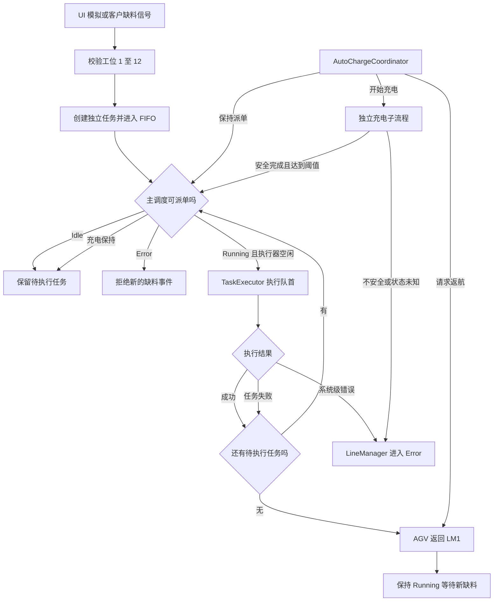
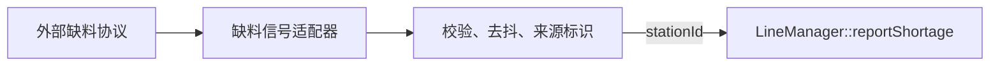
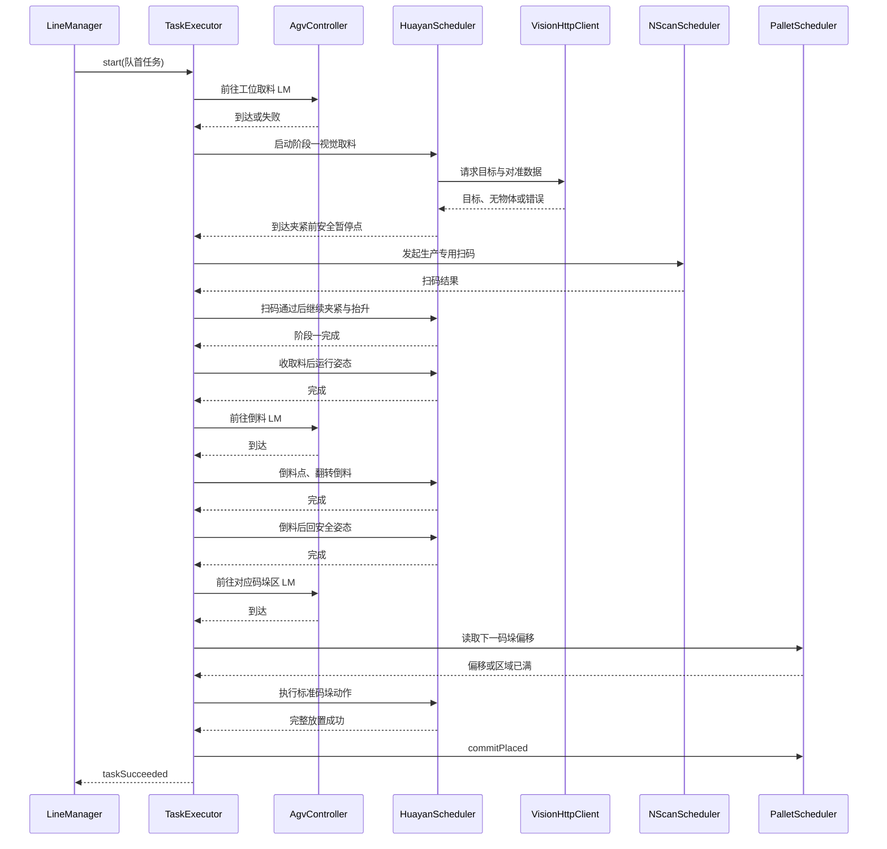
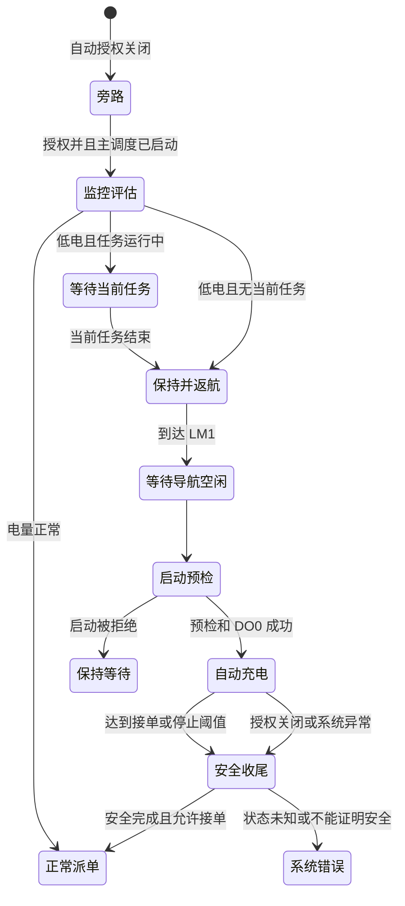

# `robot_visual` 核心调度与业务流程

> 主线范围：12 工位连续补料、单任务执行、返航及自动充电协调。

## 1. 总调度图

## 2. 缺料事件入口

当前入口是 `LineManager::reportShortage(int stationId)`。

处理原则：

- 工位号合法范围为 1 至 12。
- 每次合法调用都代表独立缺料事件，即使同一工位已经有任务，也生成不同 `taskId`。
- 任务初始状态是 `Pending`，初始业务步骤是 `Waiting`。
- `TaskQueue` 只保存待执行任务，当前执行任务由 `LineManager::m_currentTask` 单独保存。
- 新任务进入时，如果主调度为 `Running`、执行器空闲且没有充电派单保持，则尝试启动队首。
- AGV 正在无任务返 LM1 时到达新任务，主调度可以取消本次返航跟踪并切换到新任务。

未来新增真实缺料信号模块时，应先把外部数据转换为稳定的领域事件，再调用该入口。协议解析、连接重试、去抖和消息确认不应直接写进 `LineManager`。

推荐边界：

## 3. FIFO 派单

`LineManager::tryStartNext()` 是取出下一任务的统一入口。只有以下条件同时满足才允许派单：

- 整线状态为 `Running`；
- `TaskExecutor` 当前空闲；
- FIFO 中存在 `Pending`；
- 自动充电没有建立派单保持。

充电保持只阻止取出新队首：

- 不打断正在执行的任务；
- 不清空待执行任务；
- 解除保持时，若仍是 `Running` 且执行器空闲，则恢复取队首；
- `Stop`、`Error` 和复位会清理保持并发布实际电平变化。

## 4. 单任务执行主链

任务步骤以 `TaskStep` 对外展示，内部由 `TaskExecutor::ExecState` 精细推进。

重要提交语义：

- `PalletScheduler::nextPose` 或 `nextRelativeOffset` 只计算候选位置，不改变已放置数量。
- 只有机械臂标准码垛动作完整成功后才能调用 `commitPlaced`。
- 码垛动作失败时不得提前占用位置。

## 5. 工位配置

`lineconfig.h` 是工位号、取料 LM、倒料 LM、码垛区域、示教函数和取料 Z 余量的集中来源。

`StationTaskConfig` 决定：

- 取料和倒料站点；
- 空箱最终码垛区域；
- 拍照、倒料、翻转和安全回位函数；
- 夹紧后的离开策略；
- 当前工位的视觉 Z 下探余量。

`PalletAreaTaskConfig` 决定码垛 LM、基准函数和松爪函数。LM16、LM17 在当前代码注释中仍属于现场待替换值，涉及投产配置时必须再次核对。

## 6. 返回 LM1

当 FIFO 耗尽且没有当前任务时：

- AGV 已在 LM1：主调度保持 `Running`，等待新缺料。
- AGV 不在 LM1：进入 `ReturningHome`，通过 `agvDispatchRequested(1)` 使用唯一导航入口返航。
- 返回过程最长等待 5 分钟。
- 返回途中出现新任务时，可以取消本轮返航跟踪并转入任务执行。
- 自动充电只能调用 `LineManager::requestChargeReturnHome()`，不能绕过主调度直接控制 AGV。

## 7. 自动充电协调

自动充电是独立调度域，但受生产主调度协调。

协调规则：

- 自动授权关闭且没有活动自动会话时，策略完全旁路。
- 自动策略只有在授权开启且主调度状态不是 `Idle` 或 `Error` 时，才视为已参与主调度关闭责任。
- 低于启动阈值时先保持新派单；正在执行的任务允许完成安全动作。
- 无当前任务且不在 LM1 时，请求 `LineManager` 返航。
- 只有 AGV 位于 LM1、导航为空闲、充电控制器空闲且即时预检通过，才允许开始。
- 有待执行任务时，达到允许接单阈值即可开始安全收尾。
- 无待执行任务时，达到正常停止阈值才开始安全收尾。
- 充电活动期间丢失 AGV 监控或充电桩状态未知，必须安全停止并升级系统错误。
- 解除派单保持必须等待充电控制器报告安全终态。
- 关闭窗口时，自动策略未参与且没有真实充电责任的“缺少安全基线”不再拦截；真实充电责任或 `Fault` / `Unknown` 仍由设备管理层拦截。

## 8. 结果分级

| 结果 | 含义 | `LineManager` 行为 |
|---|---|---|
| 任务成功 | 当前任务完整完成 | 继续下一任务或返 LM1 |
| 普通任务失败 | 当前任务失败且安全收姿态成功 | 记录失败后继续下一任务或返 LM1 |
| 系统级错误 | 设备或状态不可安全解释 | 停设备、清待执行任务、进入 `Error` |
| 人工停止 | 操作人员要求停止整线 | 当前任务取消、待执行任务取消、进入 `Error` |
| 充电派单保持 | 暂时禁止取新队首 | 当前任务可完成，FIFO 保留 |
