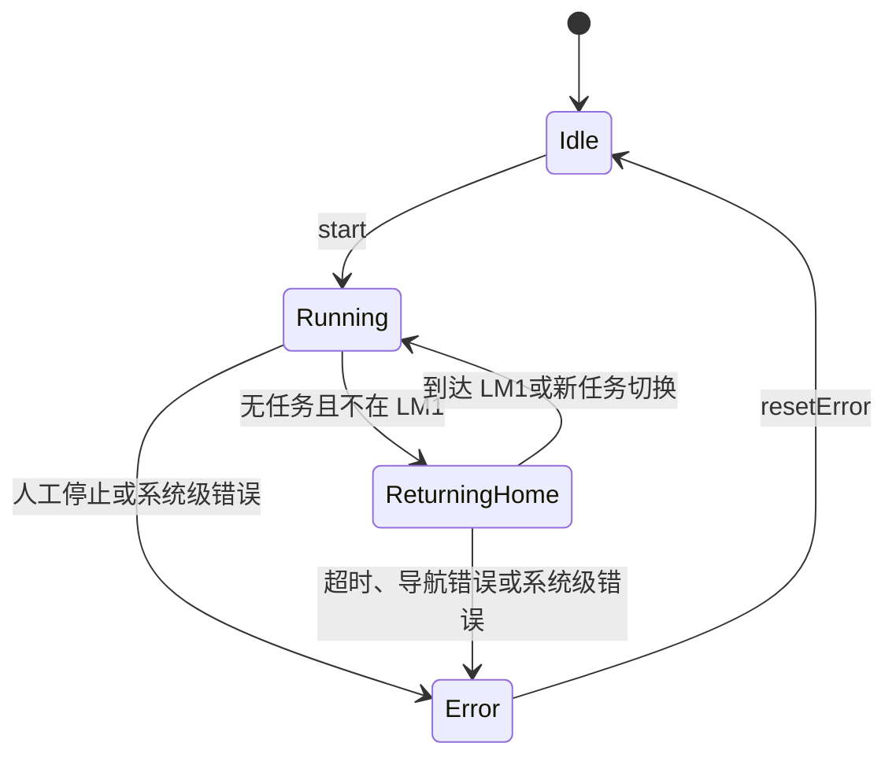

# `robot_visual` 状态机与安全约束

> 本文记录不能仅靠类图表达的停止、互斥、失败和恢复规则。

## 1. 整线状态

约束：

- `start()` 只负责从 `Idle` 进入 `Running`，不能绕过旧流程互斥检查。
- `stop()` 具有人工急停语义：停止设备、取消当前任务、清空待执行任务并进入 `Error`。
- `resetError()` 只回到 `Idle`，不会自动恢复旧任务。
- `ReturningHome` 是无当前任务时的独立导航状态，不等于任务执行。

## 2. 任务状态和业务步骤

`TaskState`：

- `Pending`：仍在 FIFO。
- `Running`：由唯一 `TaskExecutor` 执行。
- `Succeeded`：完整成功。
- `Failed`：任务终止并记录原因。
- `Canceled`：人工停止或系统清队列。

安全约束：

- 同一时间最多一个 `Running` 任务。
- `TaskQueue` 不保存 `Running` 任务。
- 任务终态不可重新放回队列继续执行；重试应生成语义明确的新任务。
- UI 只能显示任务快照，不能直接修改任务状态。

## 3. 顶层调度互斥

`LineManager` 与旧 `LineOrchestrator` 都能控制 AGV 和机械臂，二者必须互斥：

- 启动生产主调度前检查旧流程未运行。
- 启动旧流程前检查生产主调度未运行。
- 新缺料信号默认只能进入 `LineManager`。
- 不允许通过 UI 的不同按钮同时启动两条顶层流程。

## 4. AGV 导航安全

- 生产任务导航由 `TaskExecutor` 发起，空闲返航由 `LineManager` 发起。
- 自动充电返航必须使用 `LineManager::requestChargeReturnHome()`。
- 到达判断必须同时使用业务 LM 到物理站点的映射和 AGV 完整监控快照。
- `Paused`、`Failed`、`Canceled`、`Timeout` 不可视为自动充电所需的“导航空闲”。
- 自动充电只有在 LM1 且导航状态为无任务或已到达时才可继续。
- 回 LM1 超时为系统级错误。

## 5. 机械臂与视觉安全

- `HuayanScheduler` 是机械臂 SDK 的唯一动作调度器。
- 上一条机械臂命令未完成时，不得下发冲突的新命令。
- 阶段完成前先收尾内部轮询和计时器，再发完成信号，避免下一阶段刚启动就被旧阶段清理。
- 视觉目标丢失、被拒绝或 HTTP 错误必须走明确失败信号，不能使用旧坐标盲抓。
- 锁定目标后不得因相邻目标出现而静默切换。
- XY、Rz 和 Z 的联合对准、深度下降、跨帧稳定验证必须保留次数和超时上限。
- 夹紧前扫码失败时，机械臂应按既有安全路径返回，不得直接进入夹紧。

## 6. 码垛安全

- 放置位置采用“预览后提交”语义。
- 码垛区配置无效或已满时，不得发起机械臂放置。
- 只有标准码垛动作完整成功后更新 `PalletScheduler`。
- 动作失败、超时或中止不得消耗码垛位置。
- 修改工位所属码垛区域时，必须同步检查机械臂函数、LM 和占用缓存。

## 7. 自动充电安全边界

自动充电策略、业务接线和设备状态机分为三层：

1. `AutoChargeCoordinator` 决定意图。
2. `DeviceManager` 重新检查业务门禁、执行即时只读预检和 DO0 时序。
3. `ChargePileController` 执行充电桩协议和安全收尾。

不得将任意一层省略。

开始自动充电前至少满足：

- 自动授权已开启；
- 主调度不是 `Idle` 或 `Error`；
- 已取得一轮字段一致且未过期的 AGV 快照；
- 没有正在运行的生产任务；
- 已建立派单保持；
- AGV 位于 LM1；
- 导航为空闲；
- 充电控制器不忙且状态可解释；
- 即时只读预检通过；
- DO0 高电平得到确认。

停止充电时：

- 关闭自动授权不等于立即释放派单。
- 应先请求唯一控制器安全停止。
- 必须等待无输出、机构缩回、复位和最终安全查询。
- 桩端安全后再尽力关闭 DO0。
- 只有收到安全终态且满足接单电量，才允许解除派单保持。
- 不安全终态应保留自动会话所有权并进入保守恢复或主调度 `Error`。

## 8. 监控与未知状态

- AGV 电量、位置和导航字段必须来自同一轮完整快照。
- 快照超时后旧值立即失去安全决策资格。
- 自动充电前监控失效：保持派单并等待，禁止开始充电。
- 自动充电中监控失效：请求安全停止并升级系统错误。
- 充电写命令结果未知时，不能假设写入失败或设备安全，必须保守恢复。

## 9. 异常处理矩阵

| 场景 | 发现者 | 首要动作 | 队列处理 | 恢复方式 |
|---|---|---|---|---|
| 工位号非法 | `LineManager` | 拒绝事件并报警 | 不入队 | 修正输入 |
| 单任务可解释失败 | `TaskExecutor` | 停止当前阶段并报告 | 由主调度决定后续 | 新建任务重试 |
| AGV 导航致命错误 | AGV/调度层 | 停设备并进入 `Error` | 取消待执行任务 | 人工检查后复位 |
| 返 LM1 超时 | `LineManager` | 进入 `Error` | 取消待执行任务 | 人工检查后复位 |
| 视觉目标不可信 | 视觉/机械臂层 | 禁止抓取并安全停止阶段 | 当前任务失败 | 排查目标与标定 |
| 码垛区已满 | `PalletScheduler`/执行器 | 禁止放置 | 当前任务不得错误提交 | 清区或调整配置 |
| 低电但任务运行中 | 自动充电协调器 | 保持后续派单 | 保留 FIFO | 当前任务完成后返航 |
| 充电启动被拒绝 | `DeviceManager` | 保持派单并记录原因 | 保留 FIFO | 等真实输入变化后重评估 |
| 充电中监控丢失 | 自动充电协调器 | 安全停止并请求 `Error` | 取消或冻结 | 保守恢复、人工确认 |
| 充电命令结果未知 | 充电控制器 | 保守恢复 | 不得恢复派单 | 证明无输出和已缩回 |
| 应用退出时仍有风险 | `DeviceManager` | 冻结新动作并安全收尾 | 不再派单 | 收到最终安全结果后退出 |

## 10. 修改安全关键逻辑时的最低验证

- 正常路径测试。
- 边界值和超时测试。
- 重复信号、重复回调和乱序回调测试。
- 停止发生在每个关键阶段时的测试。
- 设备返回未知结果时的保守行为测试。
- 当前任务、FIFO、充电保持三者组合状态测试。
- 验证错误不会错误释放派单、提交码垛位置或继续机械臂动作。
