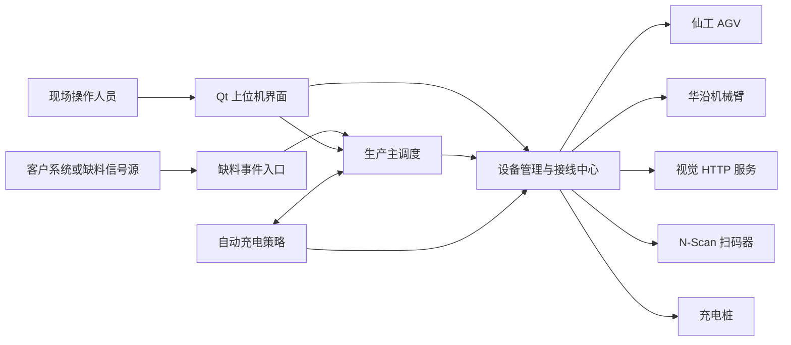
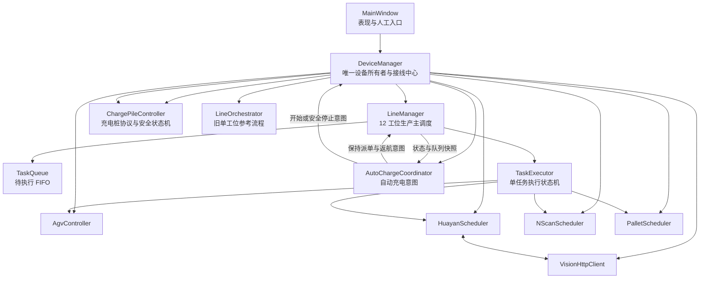

# `robot_visual` 系统架构与模块职责

> 本文只展开影响业务调度、设备所有权和安全边界的核心类。

## 1. 系统上下文

## 2. 核心组件关系

## 3. 调度核心类

### 3.1 `DeviceManager`

职责：

- 创建并唯一持有 AGV、机械臂、视觉、扫码、码垛、充电桩和调度对象。
- 建立 Qt 信号槽连接，负责跨线程边界。
- 保存设备连接配置、工位映射、运行配置和充电配置快照。
- 统一执行手动充电、自动充电、DO0、预检和应用退出安全收尾。
- 统一判断关闭窗口是否需要因充电安全拦截，并在无需拦截时取消尚未进入 DO0 的预检意图。
- 将自动充电意图连接到 `LineManager` 和唯一的 `ChargePileController`。

禁止：

- UI 或其他调度器自行创建第二个设备控制器。
- 在 `TaskExecutor` 内引入自动充电协调器。
- 通过断开网络或销毁对象代替充电安全停止。

### 3.2 `LineManager`

职责：

- 维护 `Idle`、`Running`、`ReturningHome`、`Error` 四种整线状态。
- 接收缺料事件并创建带独立 `taskId` 的任务。
- 管理只包含 `Pending` 任务的 FIFO。
- 启动唯一的 `TaskExecutor`。
- 队列耗尽后统一协调 AGV 返回 LM1。
- 接受自动充电的派单保持与返航请求。
- 将设备或外部系统致命错误统一收敛为整线 `Error`。

不负责：

- 机械臂 SDK、Modbus 或充电桩协议细节。
- 单任务内部每一步的动作推进。
- 自动充电阈值判断。

### 3.3 `TaskExecutor`

职责：

- 一次执行一个 `Task`。
- 从工位配置加载取料 LM、倒料 LM、码垛区和机械臂函数。
- 按固定阶段协调导航、视觉抓取、夹紧前扫码、倒料和空箱码垛。
- 将任务更新、任务失败和系统级错误分别反馈给 `LineManager`。

边界：

- 不读取或修改 FIFO。
- 不决定下一任务何时启动。
- 不拥有设备对象。
- 不包含自动充电逻辑。

### 3.4 `AutoChargeCoordinator`

职责：

- 聚合自动授权、AGV 电量与位置、导航状态、主调度状态、任务数量和充电控制器状态。
- 通过纯决策函数计算保持派单、返航、开始充电、安全停止、解除保持或系统错误意图。
- 对重复动作边沿去重。
- 只在自动开始被业务层接受后持有自动会话所有权。

边界：

- 不直接读取或修改 `TaskQueue`。
- 不直接调用 AGV 导航。
- 不直接发送充电桩命令。
- 不把手动充电误认为自动会话。

### 3.5 `ChargePileController`

职责：

- 独占 RTU-over-TCP 请求队列、超时、重连和协议状态机。
- 执行参数写入与回读、双重启动预检、启动、监控和安全停止。
- 安全停止覆盖停止输出、等待无输出、缩回、复位和最终安全查询。
- 区分 `Manual` 与 `Automatic` 会话来源。
- 在通信或命令结果不确定时进入保守恢复。

### 3.6 `HuayanScheduler`

职责：

- 独占华沿机械臂 SDK 调用和命令就绪判断。
- 执行阶段一视觉抓取、后续倒料、收姿态及码垛动作。
- 管理视觉目标锁定、联合 XY/Rz 对准、深度下降和稳定验证。
- 通过 `stageCompleted`、`stageError` 等信号向上层报告结果。

机械臂 SDK 命令门控、视觉抓取和运动完成证据详见《华沿机械臂视觉抓取与运动判断》。修改相关逻辑时不得只更新总架构文档。

## 4. 设备和支持模块

| 模块 | 调度层只应依赖的契约 |
|---|---|
| `AgvController` | 下发导航、取消导航、接收完整监控快照和错误 |
| `VisionHttpClient` | 发起视觉请求、返回目标或明确失败原因 |
| `NScanScheduler` | 接收扫码选项，异步返回一次扫码结果 |
| `PalletScheduler` | 计算下一放置位；机械臂完整放置成功后提交占用 |
| `SettingsManager` | 加载和原子保存已校验配置 |
| `RuntimeSettings` | 为运行中流程提供不可随意变化的参数快照 |
| `ChargeSettings` | 提供已校验并持久化的充电参数快照 |

## 5. 表现层与兼容流程

`MainWindow` 负责控件、状态展示、人工按钮和日志，不应成为业务状态机。

`LineOrchestrator` 是旧的单工位参考流程。它有独立 `LineState`，能够协调 AGV 和机械臂，因此必须通过互斥判定防止与 `LineManager` 同时运行。新缺料信号和生产功能默认接入 `LineManager`，除非需求明确属于旧流程测试。

## 6. 线程与所有权原则

- `LineManager` 和主要调度对象运行在 UI 主线程，以 Qt 信号槽推进异步流程。
- 厂商扫码 SDK 的测试入口和生产调度入口使用隔离的工作对象，底层 SDK 访问由互斥量串行保护。
- 跨线程结果必须通过信号槽返回，不允许调度层持有临时线程中的裸对象。
- 对象所有权以 `DeviceManager` 和 Qt 父子关系为准，业务调度器仅持有非拥有指针。
